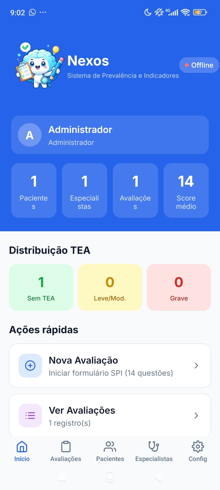
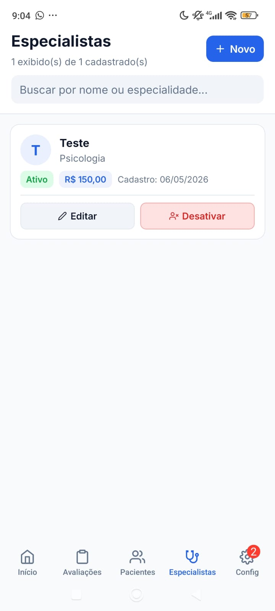
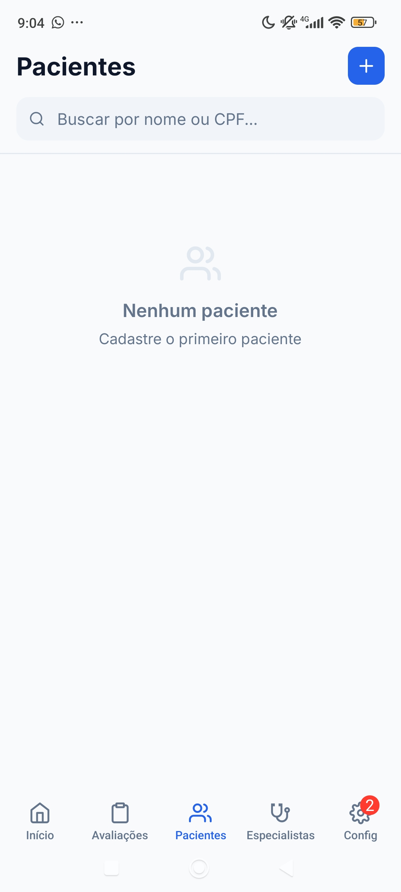
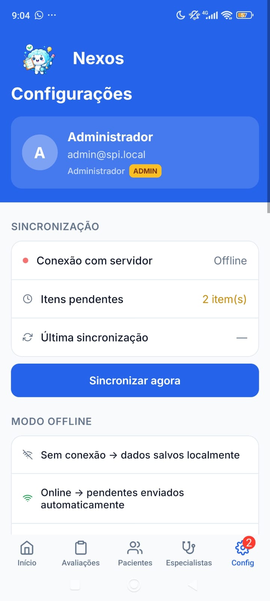

<div align="center">
	
	<br/>
	<h1>Nexos Mobile</h1>
	<p>Monorepo para o ecossistema Nexos: API, Mobile App e Sandbox de Mockups</p>
	<p>
		
		
		
		
	</p>
</div>


---

## 📱 Screenshots do App

Veja abaixo algumas telas reais do Nexos Mobile em funcionamento:

<div align="center">
	
	
	
	
</div>

---

## 🚀 Visão Geral

O **Nexos Mobile** é um monorepo que reúne:

| 📦 Módulo           | Descrição                                               |
|---------------------|--------------------------------------------------------|
| `api-server`        | Backend Node.js/TypeScript (API REST)                  |
| `mockup-sandbox`    | Frontend React/Vite para visualização de componentes   |
| `spi-mobile`        | App mobile (React Native/Expo) para uso final          |

---

## 🗂️ Estrutura do Projeto

```text
Nexos_Mobile/
├── api-server/       # Backend REST
├── mockup-sandbox/   # UI/Componentes
├── spi-mobile/       # App Mobile
```

---

## 🛠️ Como começar

<details>
<summary><strong>Clonar o repositório</strong></summary>

```bash
git clone https://github.com/seu-usuario/Nexos_Mobile.git
cd Nexos_Mobile
```
</details>

<details>
<summary><strong>API Server</strong> <code>api-server/</code></summary>

```bash
cd api-server
npm install
npm run dev # ou npm start
```
</details>

<details>
<summary><strong>Mockup Sandbox</strong> <code>mockup-sandbox/</code></summary>

```bash
cd mockup-sandbox
npm install
npm run dev
```
</details>

<details>
<summary><strong>SPI Mobile</strong> <code>spi-mobile/</code></summary>

```bash
cd spi-mobile
npm install
npm start # ou siga instruções do Expo
```
</details>

Consulte os arquivos <code>README.md</code> ou <code>GUIA-*.md</code> em cada subpasta para instruções detalhadas.

---

## 📋 Scripts Úteis

- `build.mjs`, `build-apk.sh`: scripts de build/deploy em cada módulo
- Documentação adicional: arquivos `GUIA-*.md` e pastas `docs/`

---

## 📄 Licença

Projeto sob licença MIT. Veja o arquivo [LICENSE](LICENSE) para mais detalhes.

---

<div align="center">
	<strong>Projeto mantido por Nexos</strong> <br/>
	<em>Para dúvidas, abra uma issue!</em> 🚩
</div>
